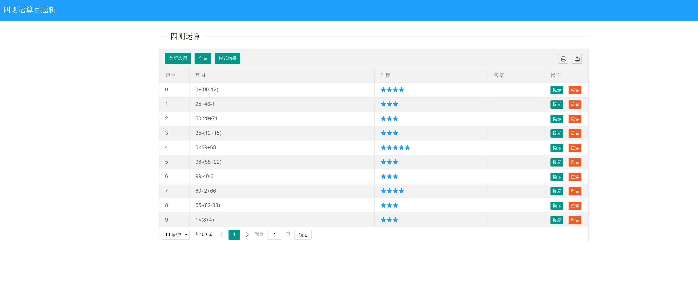
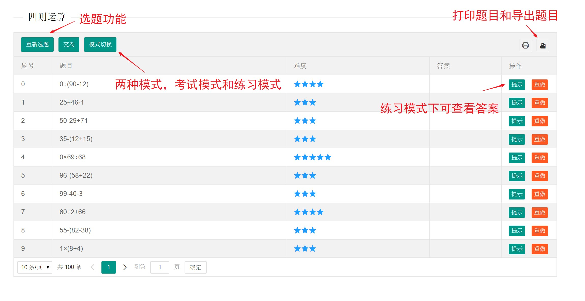
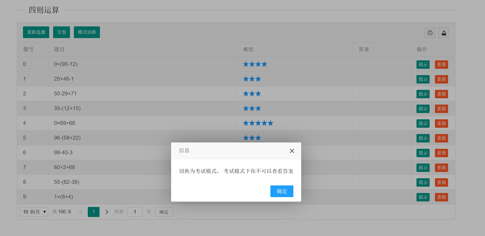
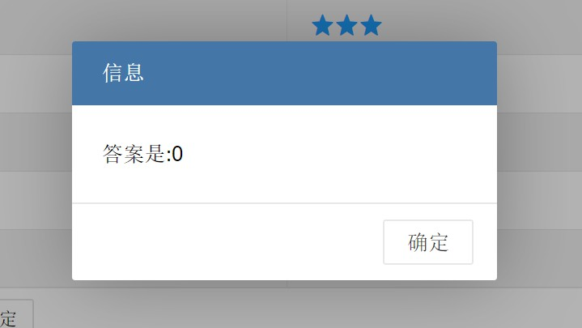
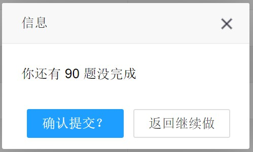
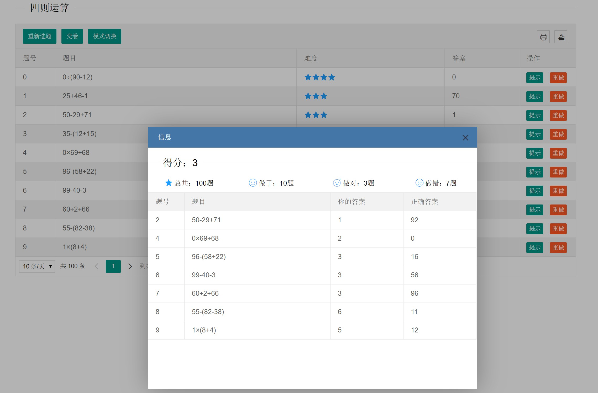
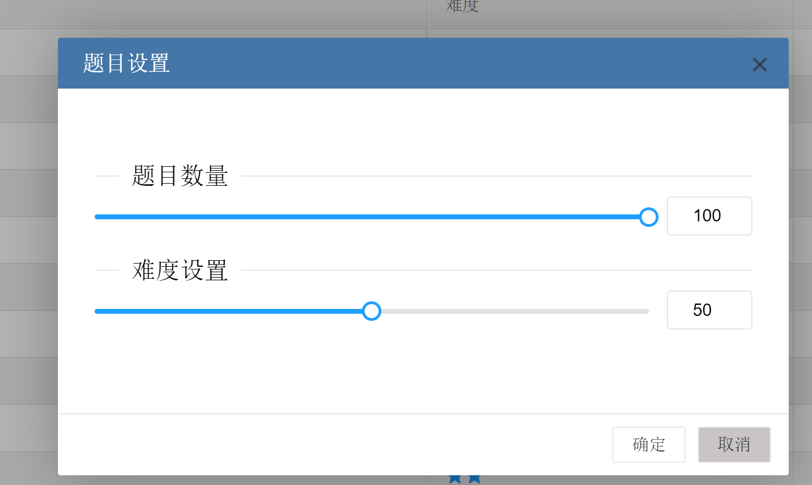

[TOC]

# 一个四则运算出题平台成品

## 四则运算程序：出30道四则运算练习题，包含三个操作数，操作数和运算结果均在100 以内。

## 主界面

## 主要功能

- 考试模式
- 练习模式
- 系统自动评分

部分功能截图如下：
- 主界面

- 模式切换

- 答案提示

- 交卷确认

- 批改结果

- 2019-4-11 新增加题目数量和难度设置

### bug修复记录
- 修复了加减法过多的问题
- 修复结果0过多的问题